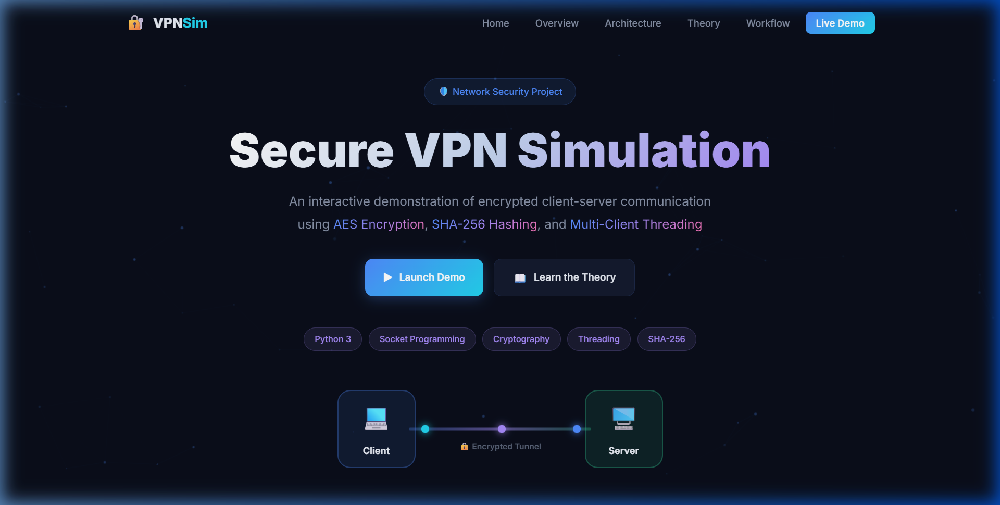
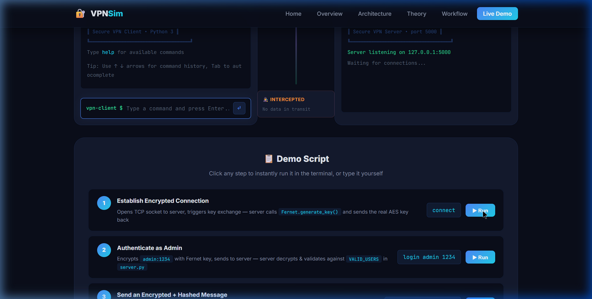
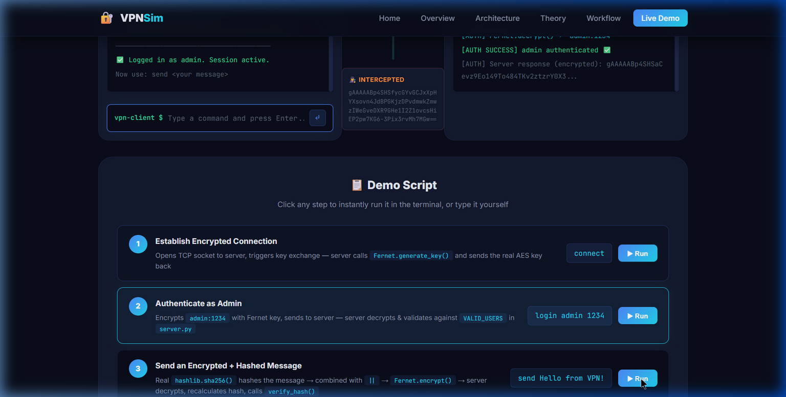
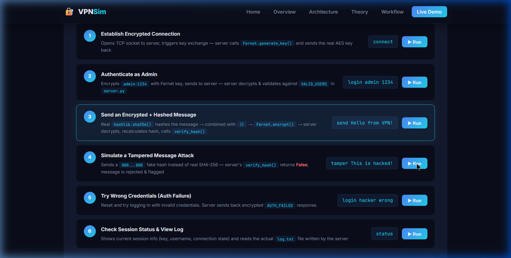
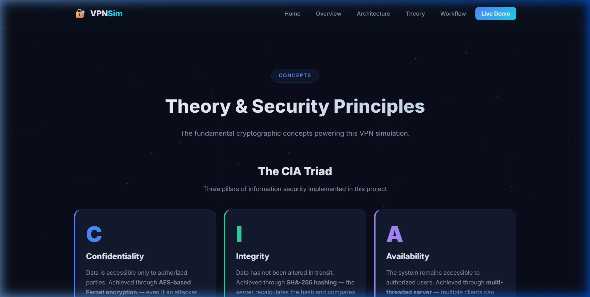
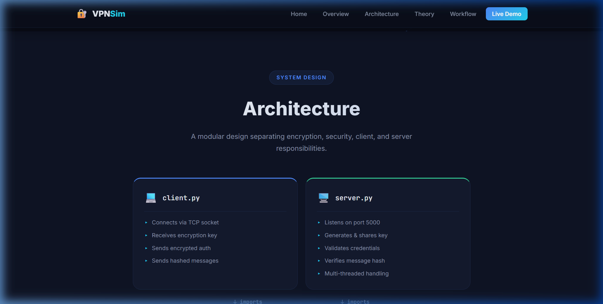

# 🔐 Secure VPN Simulation

> A Python-based VPN simulation demonstrating **AES encryption**, **SHA-256 integrity verification**, and **multi-client threading** — with a fully interactive web UI where you can run live demos directly in the browser.



---

## What It Does

Simulates the core of how a VPN works:

- **Client** connects to **Server** over a TCP socket
- Server generates a **Fernet (AES) key** and sends it to the client
- Client encrypts credentials and logs in
- Every message is **SHA-256 hashed** + **AES encrypted** before sending
- Server decrypts and **verifies the hash** — detects any tampering instantly
- Supports **multiple simultaneous clients** via threading

All three pillars of the **CIA Triad**: Confidentiality (AES), Integrity (SHA-256), Availability (Threading).

---

## Tech Stack

`Python 3` · `socket` · `cryptography (Fernet/AES)` · `hashlib (SHA-256)` · `threading` · `Flask` · `HTML/CSS/JS`

---

## Setup

```bash
# Install dependencies
pip install cryptography flask
```

---

## How to Run

### Option A — Web UI (Recommended)

Runs the interactive browser demo connected to the **real Python backend**:

```bash
python app.py
```

Open **http://127.0.0.1:5001** in your browser.

### Option B — Raw Terminal (Original)

```bash
# Terminal 1
python server.py

# Terminal 2
python client.py
```

**Valid credentials:**
| Username | Password |
|----------|----------|
| `admin`  | `1234`   |
| `user`   | `pass`   |

---

## Web UI Demo

The web UI has a real interactive terminal — type commands or click the step buttons:



| Command | What it does |
|---------|--------------|
| `connect` | TCP connection + real Fernet key exchange |
| `login admin 1234` | Encrypts credentials with AES, server verifies |
| `send <message>` | Real SHA-256 hash + AES encrypt → server verifies |
| `tamper <message>` | Injects fake hash → server detects & rejects |
| `status` | Shows session info |
| `log` | Reads `log.txt` written by the server |
| `disconnect` | Closes the session |
| `help` | Lists all commands |

**After connecting and authenticating:**



**Tamper detection — server rejects the fake hash:**



---

## Project Files

```
├── server.py        # VPN server — auth, decrypt, verify hash
├── client.py        # VPN client — encrypt, hash, send
├── encryption.py    # Fernet encryption/decryption utilities
├── security.py      # SHA-256 hash generation & verification
├── app.py           # Flask backend — connects web UI to Python code
├── index.html       # Interactive web demo
├── style.css        # Dark theme styling  
├── script.js        # Terminal command logic
└── log.txt          # Auto-generated server log of verified messages
```

---

## Screenshots




